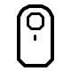

# Rebble Icon Set
Pebble-Style icons from the Pebble Firmware and the Rebble community

# App Icons

These icons are for specific third party apps or services.

| App / Service | Large Icon | Medium Icon | Small Icon | Source |
|---------------|------------|-------------|------------|--------|
| Beeper |  | 

 | 

 | hellcp |
| Blackberry Messenger |  | 

 | 

 | PebbleOS |
| Bluesky |  | 

 | 

 | Moose-On-The-Loose |
| Discord |  | 

 | 

 | Lavender |
| Duolingo |  | 

 | 

 | hellcp |
| Element |  | 

 | 

 | hellcp |
| Facebook Messenger |  | 

 | 

 | PebbleOS |
| Facebook |  | 

 | 

 | PebbleOS |
| Gmail |  | 

 | 

 | PebbleOS |
| Google Chat |  | 

 | 

 | Al Power |
| Google Hangouts |  | 

 | 

 | PebbleOS |
| Google Inbox (RIP) |  | 

 | 

 | PebbleOS |
| Google Maps |  | 

 | 

 | PebbleOS |
| Google Messenger |  | 

 | 

 | PebbleOS |
| Google Tasks |  | 

 | 

 | erlog135 |
| Hipchat |  | 

 | 

 | PebbleOS |
| Home Assistant |  | 

 | 

 | hellcp |
| Instagram |  | 

 | 

 | PebbleOS |
| KakaoTalk |  | 

 | 

 | PebbleOS |
| Kik |  | 

 | 

 | PebbleOS |
| Line |  | 

 | 

 | PebbleOS |
| LinkedIn |  | 

 | 

 | PebbleOS |
| Memfault |  | 

 | 

 | Lavender |
| Outlook |  | 

 | 

 | hellcp |
| Reddit |  |  | 

 | Lavender |
| Skype |  | 

 | 

 | PebbleOS |
| Slack |  | 

 | 

 | PebbleOS |
| Snapchat |  | 

 | 

 | PebbleOS |
| Steam |  | 

 | 

 | hellcp |
| Swarm |  | 

 | 

 | saltedlolly |
| Teams |  | 

 | 

 | hellcp |
| Telegram |  | 

 | 

 | PebbleOS |
| Threads |  | 

 | 

 | hellcp |
| Twitter |  | 

 | 

 | PebbleOS |
| Unifi Protect |  | 

 | 

 | LostQuasar |
| Viber |  | 

 | 

 | PebbleOS |
| WeChat |  | 

 | 

 | PebbleOS |
| WhatsApp |  | 

 | 

 | PebbleOS |
| Yahoo Mail |  | 

 | 

 | PebbleOS |
| Youtube |  | 

 | 

 | Lavender |
| Zoom |  | 

 | 

 | SurpriseBadger |

# Other Rebble Icons
Weather icons in [Pebble Draw Commands](https://developer.rebble.io/developer.pebble.com/guides/graphics-and-animations/vector-graphics/index.html) can be found at https://github.com/pebble-dev/resources

# Other Pebble Technology Corp Icons
See [here](./pebbleos) or for the source [check out the firmware repo](https://github.com/pebble-dev/pebble-firmware/tree/main/resources/normal/base/images).

# Have a request?
Open an issue here or join #art-design on [the Discord server.](https://rebble.io/discord)

# Have a design?
Open a PR! Or drop by [the Discord server.](https://rebble.io/discord)

# Looking for Emojis?
We also have an emoji replacement project! [Check that out here](https://github.com/pebble-dev/rebble-emojis/)
