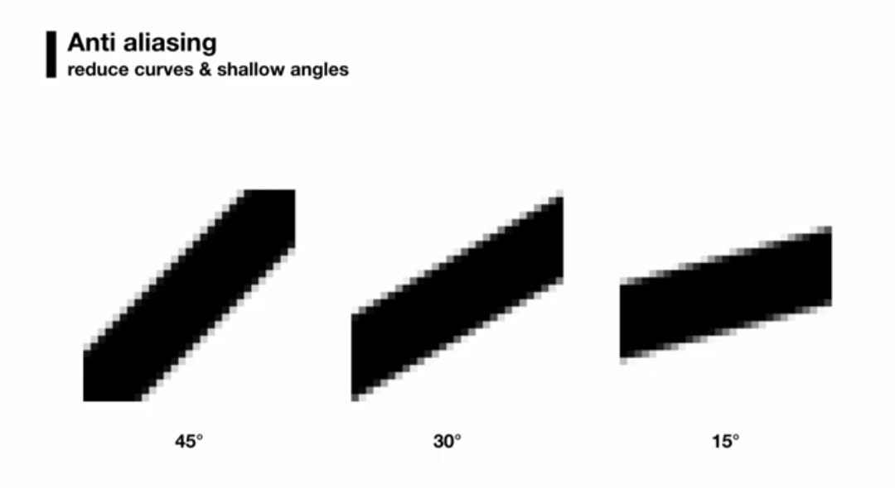

# Style Guide

### Pebble icons use a **limited set of angles**
Try to stick around 1:1 (45°), 2:1 (26.57°), and 3:1 (18.43°) rise over run, to ensure they render well at very low resolution without anti-aliasing.  Check how your icon rasterizes, on a real watch if you can.

Image from Designing Apps For Pebble | Pebble Developer Retreat 2015

### Pebble icons usually use **closed shapes** with **filled backgrounds**.

### Notification and Timeline icons come in three sizes: **25x25, 50x50,** and **80x80**.

 
- At 25px, solid lines are **2px thick**.
- At 50px, solid outlines are **3px thick**, but you can use thinner lines for detail.
- At 80px, solid outlines are **4px thick**, but you can use thinner lines for detail.

Read the limitations on SVG compatibility at https://developer.rebble.io/developer.pebble.com/guides/app-resources/converting-svg-to-pdc/index.html

...

## Submission guidelines
Create a PR to this repo with your SVGs in the appropriate folders, following the naming structure `[Name] [size]px.svg`

## Recommended Reading
A holistic understanding of designing for Pebble's limitations is great to have.
- https://www.youtube.com/watch?v=LuiK8ZiPXr4
- https://developer.rebble.io/developer.pebble.com/guides/design-and-interaction/core-experience/index.html
- https://old.heydays.no/project/pebble/
